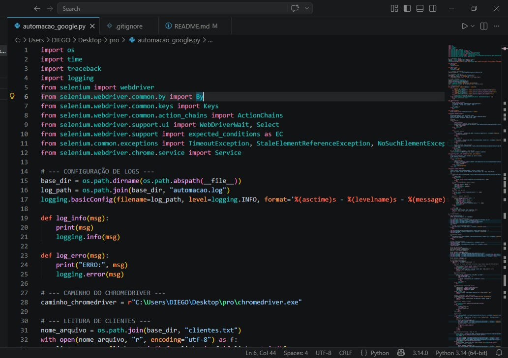

### 🤖 AutoTaskPyt - Automação IXC + Radius

## 🚀 Automação de Processos IXC + Radius

Este projeto automatiza tarefas repetitivas em sistemas de provedores de internet, reduzindo tempo operacional e erros humanos.

### 💡 Benefícios:
- Automação de múltiplos clientes
- Redução de tarefas manuais
- Execução contínua e padronizada

# 📌 Descrição

Este projeto é uma automação desenvolvida em Python utilizando Selenium para executar tarefas repetitivas em dois sistemas:

IXC (ERP de provedores)
Radius Manager

A automação realiza o processamento em lote de clientes, buscando informações no IXC e aplicando configurações automaticamente no Radius.

# 🚀 Funcionalidades

* 🔐 Login automatizado no IXC (com suporte a 2FA manual)
* 🔍 Busca automática de clientes via arquivo .txt
* 📋 Navegação dinâmica em tabelas e interfaces complexas
* 🔁 Processamento em loop de múltiplos clientes
* 🔄 Integração entre abas (IXC + Radius)
* 📥 Captura de dados e aplicação automática no Radius
* 🧠 Tratamento de erros robusto (Timeout, elementos dinâmicos, etc.)
* 📊 Geração de logs detalhados (automacao.log)

## 📊 Resultados

- Automação de +60 clientes
- Redução de tempo manual
- Execução contínua sem intervenção

# 🛠️ Tecnologias utilizadas

+ Python
+ Selenium WebDriver
+ ChromeDriver
+ Logging (logs estruturados)
+ Automação Web

# 📂 Estrutura do projeto

📁 pro/

├── automacao_google.py     # Script principal

├── clientes.txt            # Lista de clientes para processamento

├── automacao.log           # Arquivo de logs

├── .gitignore              # Arquivos ignorados pelo Git

# ⚙️ Como executar

1. Instalar dependências

pip install selenium

2. Baixar o ChromeDriver

Baixe a versão compatível com seu Google Chrome
Coloque no caminho definido no código:

caminho_chromedriver = r"C:\Users\GABRIEL\Desktop\pro\chromedriver.exe"

3. Preparar lista de clientes

No arquivo clientes.txt, adicione:

Cliente 1
Cliente 2
Cliente 3

4. Executar o script

python automacao_google.py

# 🔐 Observações importantes

* O login no IXC requer autenticação manual (2FA)
* Credenciais estão no código (⚠️ não recomendado para produção)
* O sistema depende da estrutura atual do HTML (XPATHs)

# 🎯 Objetivo do projeto

Reduzir trabalho manual repetitivo no atendimento técnico de provedores, aumentando:

- produtividade
- padronização
- redução de erros humanos

## 📸 Demonstração

🧠 Contexto real

* Este projeto foi desenvolvido com base em um cenário real de suporte técnico em provedores de internet, onde tarefas repetitivas consumiam tempo operacional.

# 👨‍💻 Autor

- Gabriel Marques
Estudante de Análise e Desenvolvimento de Sistemas
Foco em automação de processos e desenvolvimento em Python